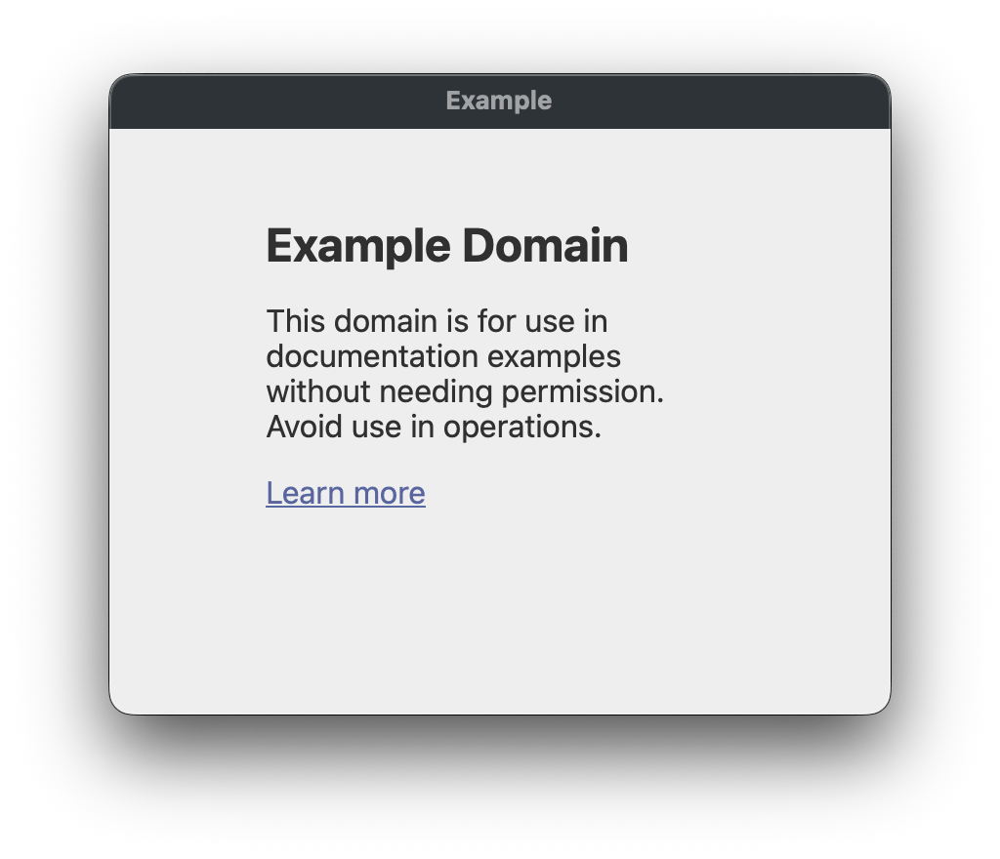

<!-- #region header -->
<!-- Generated by @toolsync/builtin/package-readme. Do not edit manually, instead run `toolsync prepare`. -->

# @lhechenberger/open-webpage

[](https://www.npmjs.com/package/@lhechenberger/open-webpage) [](https://github.com/LukasHechenberger/open-webpage#readme)

Open a webpage in a custom window from nodejs

<!-- #endregion header -->

> [!NOTE]  
> This was basically a playground project for me to get to know napi-rs. I think it turned out pretty well :)

## Installation

```shell
pnpm add @lhechenberger/open-webpage
# or bun add, yarn add, npm install ...
```

## Usage

**Basic example**

```js
import { openWebpage } from '@lhechenberger/open-webpage';

// Promise resolves once the window is closed
await openWebpage({ url: 'https://example.com' });
console.log('Window was closed');
```

...which results in a simple native window popping up, looking like this:



**You can also use an abort controller to close the page manually**

```js
import { openWebpage } from '@lhechenberger/open-webpage';

const controller = new AbortController();
const process = openWebpage({ url: 'https://example.com' }, { cancelSignal: controller.signal });

setTimeout(() => {
  console.log('Aborting process...');
  controller.abort();
}, [5000]);

try {
  await process;
} catch (error) {
  if (error.isCanceled) {
    console.log('Process was cancelled');
  } else {
    throw error;
  }
}
```

**Additional options**

```ts
import { openWebpage } from '@lhechenberger/open-webpage';

openWebpage(
  {
    url: 'https://your.url', // The URL to open
    title: 'My webpage', // Window title
    fullscreen: true, // Open in fullscreen
  },
  {
    // Options for execa, see https://www.npmjs.com/package/execa
  },
);
```

There are additional options available to customize the window's appearance, use an IDE to get hints.

## CLI

This package also ships with a small command line application

```shell
npx @lhechenberger/open-webpage --help # or bunx, pnpx, ...

# or, if you have it installed in your project:
npx open-webpage --help # or bunx open-webpage, pnpx open-webpage, ...
```

<!-- #region cli-usage -->
<!-- This section is generated. Do not edit manually! -->

```ansi
Usage: npx @lhechenberger/open-webpage [options] [url]

Arguments:
  url                The URL to open

Options:
  -V, --version      output the version number
  --devtools         Enables devtools
  --fullscreen       If the webpage should be opened fullscreen
  --title            The window's title
  --titlebar-hidden  **macOS only** If the titlebar should be hidden
  -h, --help         display help for command

```

<!-- #endregion cli-usage -->

## How it works

The package is a native Node.js addon written in Rust, built with [napi-rs](https://napi.rs/). When called from JavaScript, it spins up a native OS window with an embedded webview — no Electron, no Chromium bundled.

The key crates involved:

| Crate                                                                                           | Role                                                                                                                     |
| ----------------------------------------------------------------------------------------------- | ------------------------------------------------------------------------------------------------------------------------ |
| [`napi`](https://crates.io/crates/napi) / [`napi-derive`](https://crates.io/crates/napi-derive) | Exposes the Rust functions to Node.js as a native addon via the Node-API (N-API)                                         |
| [`tao`](https://crates.io/crates/tao)                                                           | Cross-platform windowing library — creates the native OS window and drives the event loop                                |
| [`wry`](https://crates.io/crates/wry)                                                           | Embeds the platform's system webview (WebKit on macOS/Linux, WebView2 on Windows) inside the `tao` window                |
| [`tokio`](https://crates.io/crates/tokio)                                                       | Async runtime used to integrate the blocking event loop with Node.js's async model                                       |
| [`futures`](https://crates.io/crates/futures)                                                   | Async utilities for composing the async operations                                                                       |
| [`schemars`](https://crates.io/crates/schemars) / [`serde`](https://crates.io/crates/serde)     | Generate JSON Schema from the Rust options types, which is used to produce the TypeScript type definitions at build time |

At a high level: `tao` creates a window and starts the event loop, `wry` attaches a webview to that window and loads the given URL, and `napi-rs` bridges the whole thing into a Promise that resolves when the window is closed.

<!-- #region packages -->
<!-- Generated by @toolsync/builtin/package-readme. Do not edit manually, instead run `toolsync prepare`. -->

## Packages

This repository contains the following packages:

| Name | Description | Links |
| ---- | ----------- | ----- |

<!-- #endregion packages -->
